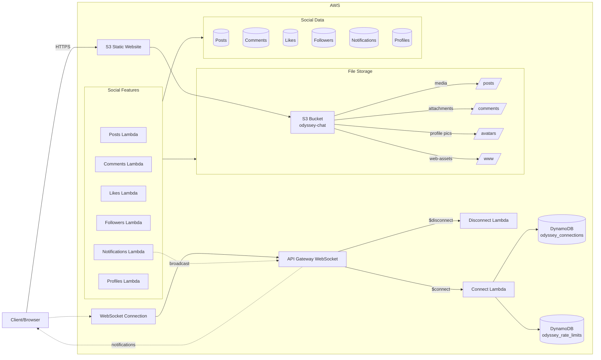

```mermaid
graph LR
    Client[Client/Browser] -.-> WSConn[WebSocket Connection]
    Client --> |HTTPS| S3Web[S3 Static Website]
    
    subgraph AWS
        S3Web --> S3[S3 Bucket<br/>odyssey-chat]
        
        subgraph FileStorage["File Storage"]
            S3 --> |media| S3P[/posts/]
            S3 --> |attachments| S3C[/comments/]
            S3 --> |profile pics| S3A[/avatars/]
            S3 --> |web-assets| S3W[/www/]
        end
        
        WSConn --> APIGW[API Gateway WebSocket]
        
        APIGW --> |$connect| Lambda1[Connect Lambda]
        APIGW --> |$disconnect| Lambda2[Disconnect Lambda]
        
        subgraph SocialFeatures["Social Features"]
            Lambda3[Posts Lambda]
            Lambda4[Comments Lambda]
            Lambda5[Likes Lambda]
            Lambda6[Followers Lambda]
            Lambda7[Notifications Lambda]
            Lambda8[Profiles Lambda]
        end
        
        Lambda1 --> DDB1[(DynamoDB<br/>odyssey_connections)]
        Lambda1 --> DDB2[(DynamoDB<br/>odyssey_rate_limits)]
        
        subgraph SocialData["Social Data"]
            DDB3[(Posts)]
            DDB4[(Comments)]
            DDB5[(Likes)]
            DDB6[(Followers)]
            DDB7[(Notifications)]
            DDB8[(Profiles)]
        end

        SocialFeatures --> SocialData
        SocialFeatures --> FileStorage
        
        Lambda7 -.-> |broadcast| APIGW
    end

    APIGW -.-> |notifications| Client
```