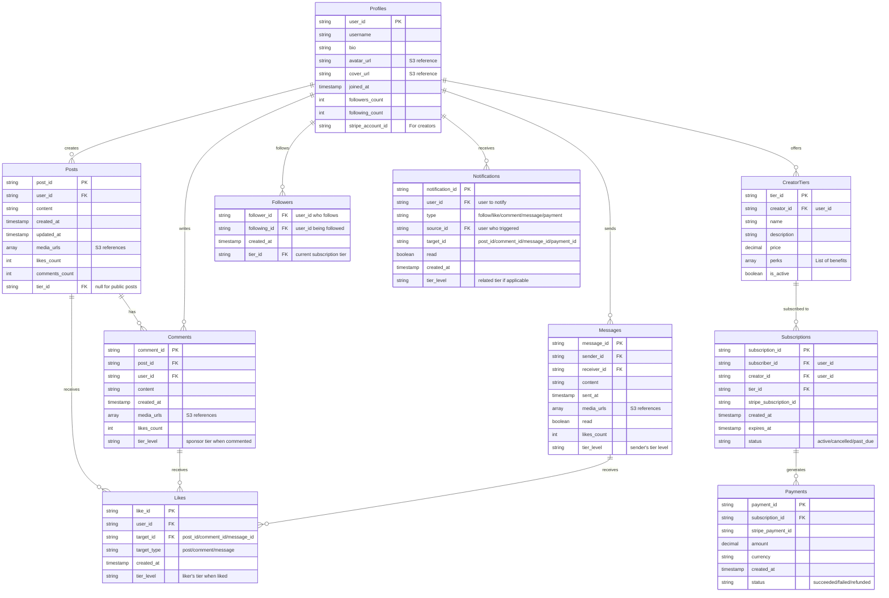

```mermaid
erDiagram
    %% Entities with media storage (highlighted in blue)
    Posts {
        string post_id PK
        string user_id FK
        string content
        timestamp created_at
        timestamp updated_at
        array media_urls "S3 references"
        int likes_count
        int comments_count
        string tier_id FK "null for public posts"
    }

    Comments {
        string comment_id PK
        string post_id FK
        string user_id FK
        string content
        timestamp created_at
        array media_urls "S3 references"
        int likes_count
        string tier_level "sponsor tier when commented"
    }

    Messages {
        string message_id PK
        string sender_id FK
        string receiver_id FK
        string content
        timestamp sent_at
        array media_urls "S3 references"
        boolean read
        int likes_count
        string tier_level "sender's tier level"
    }

    Profiles {
        string user_id PK
        string username
        string bio
        string avatar_url "S3 reference"
        string cover_url "S3 reference"
        timestamp joined_at
        int followers_count
        int following_count
        string stripe_account_id "For creators"
    }

    CreatorTiers {
        string tier_id PK
        string creator_id FK "user_id"
        string name
        string description
        decimal price
        array perks "List of benefits"
        boolean is_active
    }

    Subscriptions {
        string subscription_id PK
        string subscriber_id FK "user_id"
        string creator_id FK "user_id"
        string tier_id FK
        string stripe_subscription_id
        timestamp created_at
        timestamp expires_at
        string status "active/cancelled/past_due"
    }

    Payments {
        string payment_id PK
        string subscription_id FK
        string stripe_payment_id
        decimal amount
        string currency
        timestamp created_at
        string status "succeeded/failed/refunded"
    }

    Likes {
        string like_id PK
        string user_id FK
        string target_id FK "post_id/comment_id/message_id"
        string target_type "post/comment/message"
        timestamp created_at
        string tier_level "liker's tier when liked"
    }

    Followers {
        string follower_id FK "user_id who follows"
        string following_id FK "user_id being followed"
        timestamp created_at
        string tier_id FK "current subscription tier"
    }

    Notifications {
        string notification_id PK
        string user_id FK "user to notify"
        string type "follow/like/comment/message/payment"
        string source_id FK "user who triggered"
        string target_id "post_id/comment_id/message_id/payment_id"
        boolean read
        timestamp created_at
        string tier_level "related tier if applicable"
    }

    %% Relationships
    Posts ||--o{ Comments : has
    Posts ||--o{ Likes : receives
    Comments ||--o{ Likes : receives
    Messages ||--o{ Likes : receives
    Profiles ||--o{ Posts : creates
    Profiles ||--o{ Comments : writes
    Profiles ||--o{ Messages : sends
    Profiles ||--o{ Followers : "follows"
    Profiles ||--o{ Notifications : receives
    Profiles ||--o{ CreatorTiers : offers
    CreatorTiers ||--o{ Subscriptions : "subscribed to"
    Subscriptions ||--o{ Payments : generates

    %% Note: Posts, Comments, Messages, and Profiles contain S3 media references
```